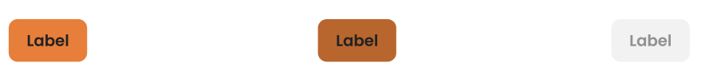
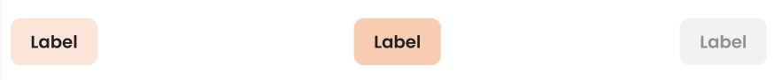
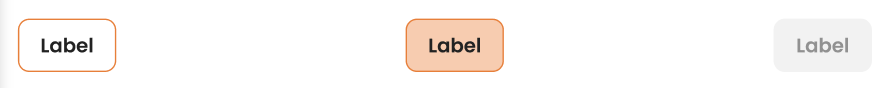
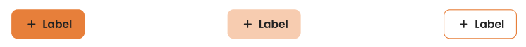
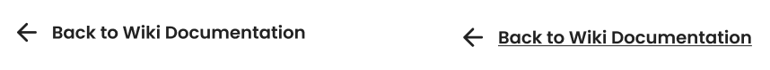

# AppButton

A flexible button component built on top of MUI's `Button`, providing four semantic variants aligned with the design system's visual hierarchy.

---

## Guidelines

### Do

- Label buttons **clearly and concisely** — the label should always describe the action it triggers
- Highlight the most important action using the **primary** variant
- Use variants **consistently** across the application
- Place buttons in **consistent locations** across similar views

### Don't

- Use vague labels like *OK* or *Yes*
- Place **multiple primary buttons** in the same view
- Apply **custom colors** — variant colors are designed for consistency and accessibility
- Use icons **only for decoration** — every icon must relate directly to the action

---

## Props

| Prop | Type | Default | Description |
|---|---|---|---|
| `variant` | `"primary" \| "secondary" \| "tertiary" \| "borderless"` | `"primary"` | Visual style of the button |
| `text` | `string` | `"Create"` | Button label |
| `onClick` | `() => void` | — | Click handler |
| `disabled` | `boolean` | `false` | Disables the button |
| `type` | `"button" \| "submit" \| "reset"` | `"button"` | HTML button type |
| `fullWidth` | `boolean` | `false` | Stretches button to fill its container |
| `startIcon` | `ReactNode` | — | Icon shown before the label |
| `sx` | `SystemStyleObject` | — | Additional MUI sx overrides |
| `id` | `string` | — | HTML id attribute |

---

## Variants

### Primary

The highest-emphasis button. Use it for the **main, required, or essential action** in a view or workflow.




```tsx
<AppButton variant="primary" text="Label" />
```

> Do not place multiple primary buttons next to each other. Each view should have at most one primary action.

---

### Secondary

A medium-emphasis button. Use it for actions that are **less prominent than the primary** action or not essential to completing a process.




```tsx
<AppButton variant="secondary" text="Label" />
```

---

### Tertiary

A low-emphasis button. Use it for **additional or supplementary actions** alongside primary and secondary buttons.




```tsx
<AppButton variant="tertiary" text="Label" />
```

---

## With Leading Icon

All variants support a leading icon via the `startIcon` prop. Use icons to **clarify an action** or to distinguish an important button from others. Icons should always be relevant to the action — never decorative.



```tsx
<AppButton variant="primary" text="Label" startIcon={<AddIcon />} />
```
---

### Borderless

The lowest visual weight. Use it when an action needs to **carry less visual emphasis** than the surrounding buttons, for example inline or contextual actions.




```tsx
<AppButton variant="borderless" text="Back to Wiki Documentation" startIcon={<ArrowBackIcon />}/>
```

