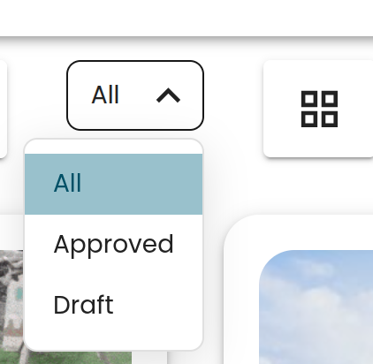

# Dropdown component

Dropdown component is used for dropdown menus in the project.

## Guidelines

### Do this
- Organize the dropdown content in alphabetical order
- Keep labels clear and easy to scan
- Ensure the selected option is clearly visible
- Keep dropdown width consistent with its context, such as matching table column widths when multiple dropdowns are used      together, to maintain alignment and a clean layout

### Don't do this
- Use unclear or overly long labels
- Mix unrelated actions or selections in the same dropdown
- Allow dropdown width to vary between instances, especially in structured layouts like tables, as it breaks visual alignment and reduces clarity.

---

## Properties

Prop                        | Type                               | Description
----------------------------|------------------------------------|-------------
`displayOption`             | string                             | Currently selected display option in the menu
`handleDisplayOptionChange` | function                           | Called when selected option changes
`displayOptions`            | { value: string; label: string }[] | Array of available display options with value and label

## Usage example

```tsx
<Dropdown
  displayOption={displayOption}
  handleDisplayOptionChange={handleDisplayOptionChange}
  displayOptions={[
    { value: "all", label: strings.wikiDocumentation.allArticles },
    { value: "approved", label: strings.wikiDocumentation.approvedArticles },
    { value: "draft", label: strings.wikiDocumentation.draft }
  ]}
 />
```
Display options can bee defined elsewhere as well. Code above would result in following dropdown menu:


All dropdown menus are styled the same, so no additional styling is required.

> NOTE: All dropdown menu display options are capitalzed. If menus with different kind of textTransform are required in the future, this component must be edited